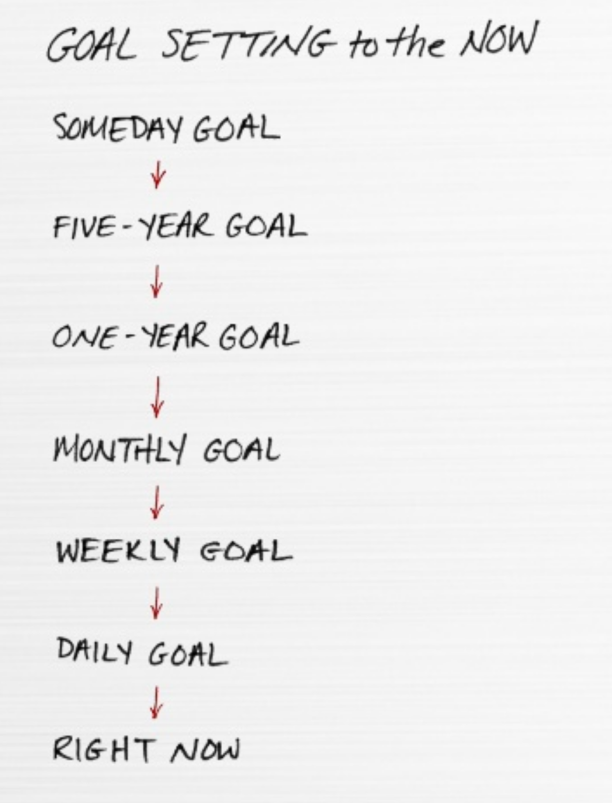

## The six lies

### Everything matters equally

- Go small.
  - busy vs productive: we are not looking to be busy, we are looking to be productive
- Go extreme.
  - Pareto principle 80/20: only do the 20% that produces 80% of the results
  - Down to one thing: apply pareto recursively, until you get the most important task to accomplish
- Say no.
  - “Later”, “never”: “not now” to anything else until your most important work is done.
- Don’t get trapped in the “check off” game.
  - Things don’t matter equally
  - TODO list vs Success list: most items on TODO list will never get done.

### Multitasking

> “It’s not that we have too little time to do all the things we need to do, it’s that we feel the need to do too many things in the time we have”

- Multitasking takes a toll.
  - Juggling is an illusion: balls get moved one at a time
  - Task switching has a cost
- Distraction undermines results.
  - E-mail, chat, support...

### A disciplined life

- Think habits vs discipline.
- Build one habit at a time.
- Give each habit enough time.
- Habits, on average, take 66 days to form.

### Willpower is always on will-call

- Don't spread your willpower too thin.
  - Limited supply of willpower each day.
- Monitor your fuel gauge.
  - Full-strength willpower requires a full tank. Eat right and regularly.
  - Take breaks
- Time your task.
  - Do what matters most when your willpower is strongest. Early in the morning, after breaks...

### A balanced life

- Balance vs Counterbalance
  - Counterbalancing = you never go so far that you can’t find your way back
  - Leaving some things temporarily undone is a necessary tradeoff for extraordinary results.
- Two buckets.
  - work life vs personal life, each has its own counterbalancing goals and approaches.
- Two types of counterbalance.
  - Balancing between work and life (overtime!)
  - Balancing within each

Examples:

- Counterbalance your work bucket.
  - Give disproportionate time to your ONE Thing. It will throw the rest of your work day, week, month, and year continually out of balance. Your work life is divided into two distinct areas--what matters most and everything else. You will have to take what matters to the extremes and be okay with what happens to the rest. Professional success requires it.
- Counterbalance your personal life bucket.
  - Spirit, body, family, friends... each requires a minimum of attention for you to feel that you "have a life." Drop any one and you will feel the effects. This requires constant awareness. You must never go too long or too far without counterbalancing them so that they are all active areas of your life. Your personal life requires it.

### Big is bad

- Think big.
  - Avoid incremental thinking that simply asks, "What do I do next?"
  - Think big and figure out the path to get there.
  - Worst case you always end up in a better place than originally.
- Don't order from the menu.
  - Don’t choose from the available options; imagine outcomes that no one else have.
  - Apple’s Think Different: “People who are crazy enough to think they can change the world are the only ones who do."
- Don't fear failure.
  - “we fail our way to success”
  - When we fail, we stop, ask what we need to do to succeed, learn from our mistakes, and grow.

## The Focusing Question

### The Domino Effect

Small dominos can topple much larger dominos; stack them right.

### The Focusing Question

- Great questions are the path to great answers.
- The Focusing Question:
  - Big picture and small focus
  - One is about finding the right direction in life and the other is about finding the right action.
  - Big Picture: “What’s my ONE Thing?”
  - Small Focus: “What’s my ONE Thing right now?”

### The Success Habit

- Understand and believe the concept of the ONE Thing.
- "What's the ONE Thing I can do today to [XXX] such that by doing it everything else will be easier or even unnecessary?"
- Make it a habit / Leverage reminders.
- Recruit support.

### The Path to Great Answers

- Think big and specific.
- Think possibilities.
  - Setting a doable goal is almost like creating a task to check off your list. A stretch goal is more challenging.

## Extraordinary Results

### Goal Set to the Now

- There can only be ONE.
  - Your most important priority is the ONE Thing you can do right now that will help you achieve what matters most to you. You may have many "priorities," but dig deep and you'll discover there is always one that matters most, your top priority--your ONE Thing.
- Goal Set to the Now.
  - Knowing your future goal is how you begin. Identify the steps you need to accomplish to reach that goal.

### Time Blocking

- Time block your planning time.
- Time block your ONE Thing.
  - Make regular appointments with yourself
  - Block big chunks of it--no less than four hours!
- Time block your time off.
- Protect your time block at all costs.
  - "Nothing and no one has permission to distract me from my ONE Thing."
  - Build a bunker: find somewhere to work that takes you out of the path for disruption and interruption.
  - Store provisions: supplies, materials, snacks… avoid leaving your bunker
  - Sweep for mines: Turn off your phone, shut down e-mails, exit web browser...
  - Enlist support: Tell those most likely to seek you out what you are doing and when you’ll be available.

### The Four Thieves

- Inability to say “no”
  - When you say yes to something, you're saying no to everything else.
- Fear of chaos.
  - Recognize that pursuing your ONE Thing moves other things to the back burner. This kind of chaos is unavoidable. Make peace with it. Learn to deal with it. The success you have accomplishing your ONE Thing will continually prove you made the right decision.
- Poor Health Habits
  - Manage your energy. Don't sacrifice your health by trying to take on too much.
- Environment doesn’t support your goals
  - Make sure that the people around you and your physical surroundings support your goals.

## Meaningful Quotes

“Be like a postage stamp— stick to one thing until you get there.” – Josh Billings

“Things which matter most must never be at the mercy of things which matter least.” – Johann Wolfgang von Goethe

“The things which are most important don’t always scream the loudest.” – Bob Hawke

“To do two things at once is to do neither.” – Publilius Syrus

“Multitasking is merely the opportunity to screw up more than one thing at a time.” – Steve Uzzell

“Success is simple. Do what’s right, the right way, at the right time.” – Arnold H. Glasow

“People do not decide their futures, they decide their habits and their habits decide their futures.” – F. M. Alexander

“Life isn’t about finding yourself. Life is about creating yourself.” -George Bernard Shaw

“Productivity isn’t about being a workhorse, keeping busy or burning the midnight oil… . It’s more about priorities, planning, and fiercely protecting your time.” – Margarita Tartakovsky

“Efficiency is doing the thing right. Effectiveness is doing the right thing.” – Peter Drucker

“Nobody who ever gave his best regretted it.” – George Halas

“Surround yourself only with people who are going to lift you higher.” – Oprah Winfrey
